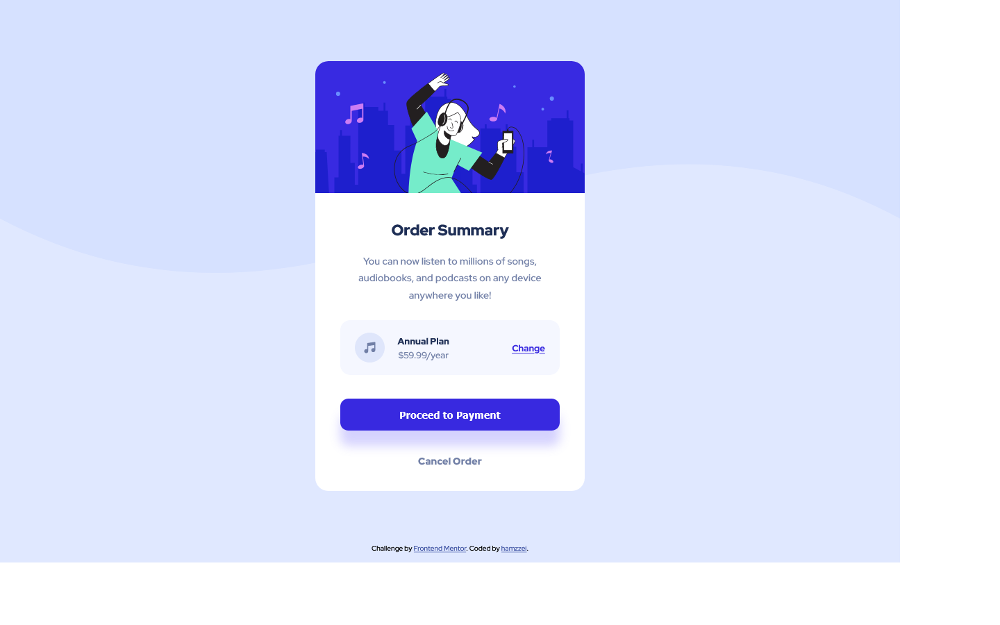

# Frontend Mentor - Order summary card solution

This is a solution to the [Order summary card challenge on Frontend Mentor](https://www.frontendmentor.io/challenges/order-summary-component-QlPmajDUj). Frontend Mentor challenges help you improve your coding skills by building realistic projects. 

## Table of contents

- [Overview](#overview)
  - [The challenge](#the-challenge)
  - [Screenshot](#screenshot)
  - [Links](#links)
- [My process](#my-process)
  - [Built with](#built-with)
  - [What I learned](#what-i-learned)
  - [Continued development](#continued-development)
  - [Useful resources](#useful-resources)
- [Author](#author)

## Overview

### The challenge

Users should be able to:

- See hover states for interactive elements

### Screenshot



### Links

- Solution URL: https://github.com/hamzzei/order-summary-component
- Live Site URL: https://hamzzei.github.io/

## My process

### Built with

- Semantic HTML5 markup
- CSS custom properties
- CSS Grid
- Flexbox
- Mobile-first workflow

### What I learned

The main structure of the page was created using CSS Grid. I found this gave me the control I needed to center the main card and also control how the space around the card behaved. I wanted to include the attributes as a footer and this was a lot simpler with Grid than it would have been without it. 

I used Flexbox a small amount on the page, simply to display the contents of the pricing box in a row rather than vertically. To keep things as simple as possible, I separated the content into three div containers, with the 'Annual Plan' and '$59.99/year' text all kept in the same div so they wouldn't be split up by the Flexbox container.

```html
<div id="plan_container">
      
      <div id="plan_details">
        <p id="plan_type">Annual Plan</p>
        <p id="plan_cost">$59.99/year</p>
      </div>
      <p id="change"><a href="#">Change</a></p>
    </div>
```
Something that was a bit of a challenge for me was adding a background image to the site because I hadn't needed to include one on any previous projects, but with a little research on w3schools I found that it was quite straightforward.

I tried to get the card to scale dynamically as the screen size changes, but in the end I found that a simple media query worked very well in this instance. 

Below are some of the main changes I made with the media query: 

```css
@media (min-width: 600px) {
    body{
        background: url(pattern-background-desktop.svg), hsl(225, 100%, 94%);
        background-repeat: no-repeat;
        background-size: max(1440px, 100vw) auto;
    }
    #card {
        height: 43rem;
        width: 27rem;
        grid-template-columns: 2.5rem auto 2.5rem;
    }
}
```

### Continued development

In future projects I want to use Flexbox more as I am a lot more comfortable with Grid. In this project I leaned on Grid for almost everything even when Flexbox might have been a good option, so this is definitely something I want to get better with.

I also wanted to build the project using a mix of Math functions and relative values to make the transition from mobile view to desktop view smoother, but after finding it more difficult than I expected, I ended up using a media query on this occasion. While the media query works fine, I want to practice creating more dynamic pages in the future.

### Useful resources

- [w3schools](https://www.w3schools.com/cssref/pr_background-image.asp) - This was the page I used to help me understand how background images work.
- [w3schools](https://www.w3schools.com/cssref/css3_pr_box-shadow.asp) - This page helped me to understand the values of the box-shadow property when I was having a few issues with them.

## Author

- Github - [hamzzei](https://github.com/hamzzei)
- Frontend Mentor - [@hamzzei](https://www.frontendmentor.io/profile/hamzzei)

